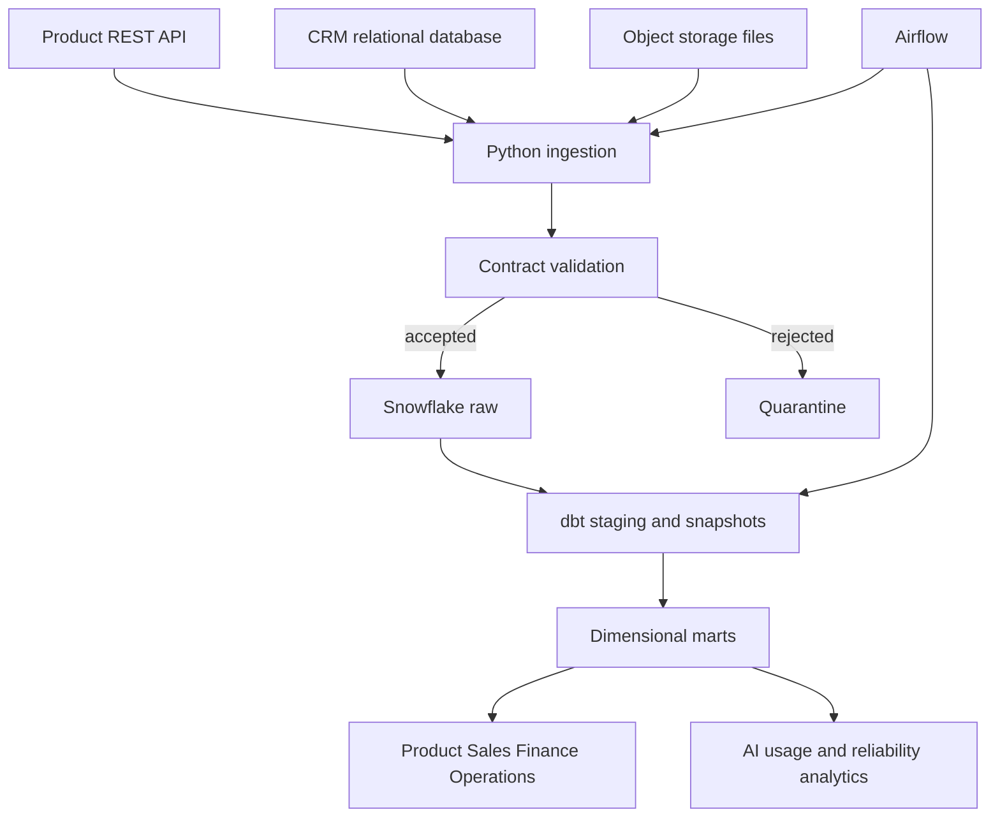

# Enterprise SaaS ELT and Analytics Platform

[](https://github.com/subhadeepdeb/enterprise-saas-elt-platform/actions/workflows/ci.yml)

A production-style data platform that integrates product activity, CRM, billing, and AI-application telemetry into tested Snowflake analytics marts. Python handles extraction and contract validation, Airflow coordinates the workflow, and dbt builds documented dimensional models for Product, Sales, Finance, and Operations.

This repository uses deterministic synthetic data, so it is safe to clone, run, and discuss in interviews without exposing customer or employer information.

## What this project demonstrates

- Multi-source ingestion from REST-style JSON, a relational CRM database, and object-storage CSV files
- Idempotent landing files with row hashes, run manifests, quality gates, and rejected-record quarantine
- Airflow retries, backfills, timeouts, dependency management, and webhook failure alerts
- Snowflake raw, staging, snapshot, and analytics layers with separate ingest, transform, and BI warehouses
- dbt incremental `merge` models, source freshness, schema evolution, tests, documentation, and lineage
- Product analytics events and AI telemetry for latency, token usage, cost, adoption, and errors
- Star-schema marts and a certified KPI layer for Product, Sales, Finance, and Operations
- Governance examples for RBAC, dynamic email masking, regional row access, and PII-aware marts
- Cost controls through auto-suspend, right-sized warehouses, clustering, incremental lookbacks, and a resource monitor
- GitHub Actions checks for Python quality, unit tests, SQL safety, and project structure

## Architecture



## Source systems

| Source | Demo representation | Production analogue | Key entities |
|---|---|---|---|
| Product application | JSON API payloads | REST API or event collector | events, sessions, users |
| AI application | JSON API payloads | LLM gateway or observability stream | model, version, tokens, latency, cost, errors |
| CRM | SQLite | Salesforce or PostgreSQL | accounts, users, opportunities |
| Billing operations | CSV object | S3 file drop or billing API | invoices and payment status |

## Repository map

```text
airflow/dags/            Daily orchestration and failure callback
src/saas_elt/            Generators, contracts, ingestion, validation, manifests
scripts/                 Snowflake raw loader and repository checks
models/                  dbt staging, intermediate, and analytics models
snapshots/               SCD Type 2 account history
tests/dbt/               Singular business-rule tests
snowflake/               Warehouses, raw objects, RBAC, masking, row access, cost controls
docs/                    Architecture, governance, KPIs, data model, and operations runbook
.github/workflows/       CI checks
```

## Quick start without Snowflake or Airflow

Python 3.10 or later is sufficient for the local ingestion demonstration.

```bash
python -m venv .venv
source .venv/bin/activate  # Windows: .venv\Scripts\activate
python -m pip install -e ".[dev]"
python -m saas_elt.cli generate-sample --rows 250
python -m saas_elt.cli ingest --run-date 2026-09-19
pytest -q
```

The sample generator creates three source styles under `data/source/`. The ingestion command validates each dataset, writes accepted records as compressed JSON Lines under `data/landing/`, sends invalid records to `data/quarantine/`, and creates a run manifest with row counts and schema metadata.

## Run against Snowflake

1. Create a Snowflake trial or use an existing account.
2. Run `snowflake/setup.sql`, followed by `snowflake/rbac.sql` and `snowflake/governance.sql` with an appropriately privileged role.
3. Copy `.env.example` to `.env`, then populate the Snowflake variables. Never commit the file.
4. Copy `profiles.yml.example` to `profiles.yml`.
5. Install the optional dependencies:

```bash
python -m pip install -e ".[dev,transformation]"
dbt debug --profiles-dir .
python scripts/load_to_snowflake.py --manifest data/landing/_manifests/<manifest>.json
dbt deps
dbt source freshness --profiles-dir . --target dev
dbt build --profiles-dir . --target dev
dbt docs generate --profiles-dir . --target dev
dbt docs serve --profiles-dir .
```

## Airflow orchestration

Set `SAAS_ELT_PROJECT_ROOT` to the repository location visible to Airflow and add `airflow/dags/saas_elt_pipeline.py` to the DAG folder. The DAG runs daily at 05:00 UTC and performs:

1. Multi-source ingestion and manifest creation
2. A two-percent rejected-row quality gate
3. Raw-file loading into Snowflake
4. `dbt build`, including models and tests
5. dbt documentation artifact generation
6. Webhook notification when any task fails, if `ALERT_WEBHOOK_URL` is configured

## Analytics products

| Model | Grain | Primary consumers | Example questions |
|---|---|---|---|
| `dim_accounts` | account | Sales, Finance, Product | Which account segments are adopting the platform? |
| `dim_users` | user | Product, Customer Success | Which countries and accounts have active users? |
| `fct_product_events` | event | Product | What features drive activation and retention? |
| `fct_ai_usage` | AI request | AI Engineering, Finance | What are latency, error rate, tokens, and cost by model? |
| `fct_account_daily_metrics` | account-day | Product, Customer Success | Which accounts show declining engagement? |
| `fct_opportunities` | opportunity | Sales, Finance | What is pipeline value and win conversion? |
| `fct_invoices` | invoice | Finance, Operations | What revenue is collected, open, or past due? |
| `mart_executive_kpis` | day | Leadership and BI | What are daily adoption, reliability, and revenue trends? |

The [KPI catalog](docs/kpi_catalog.md) defines the shared metrics and their owners.

## Reliability and governance design

- Contract checks occur before warehouse loading; rejected rows preserve validation errors for investigation.
- Every accepted record receives a deterministic SHA-256 row hash for replay and reconciliation.
- dbt sources enforce freshness thresholds and model tests cover keys, relationships, accepted values, future timestamps, negative costs, and missing AI error codes.
- Raw PII remains restricted. The analytics user dimension exposes a masked email, and Snowflake policy examples show centralized masking and regional row access.
- Separate roles and warehouses limit privileges and attribute cost by workload.
- Incremental models use bounded lookback windows to capture late-arriving data without repeated full refreshes.

See [governance](docs/governance.md) and the [operations runbook](docs/runbook.md) for details.

## Design decisions and limitations

- The local CRM source is SQLite and the API is represented by deterministic JSON payloads so anyone can reproduce the demonstration. The interfaces map directly to PostgreSQL/Salesforce and HTTP extraction patterns.
- Snowflake and Airflow execution require user-provided accounts and credentials. No secrets, real customer data, or generated landing data are committed.
- The project focuses on transparent, reviewable data engineering patterns rather than a hosted dashboard.

## License

MIT

